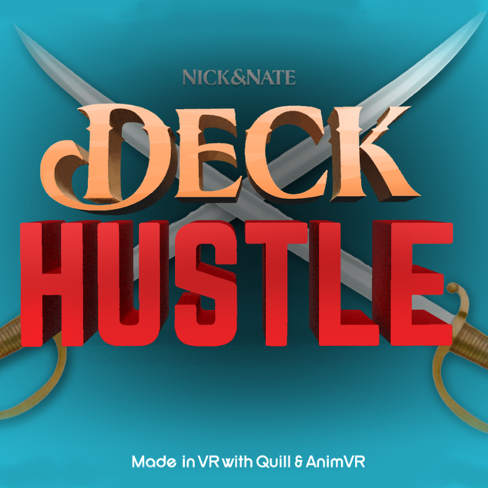

# DeckHustle

### Man the cannon and fire at the ghost ship! Be wary however, the ghost captain won't go down easily.

# How to Play
Simply use WASD or arrow keys to move your pirate across the ship's deck. Win by bringing cannonballs from the box to the cannon enough times to destroy the enemy ship while dodging the enemy projectiles. Normal mode is pretty tough, but if you're looking for a real challenge, test your might in Legendary mode!

> The assets made for *Deck Hustle*
> were made in virtual reality using Quill
> art software. Scripts were written in
> C# through Visual Studio and the game
> was made in the Unity Engine.

# Pictures

# Credits
- Nathan Ladd - Programming
- Nick Ladd - Art and Assets
